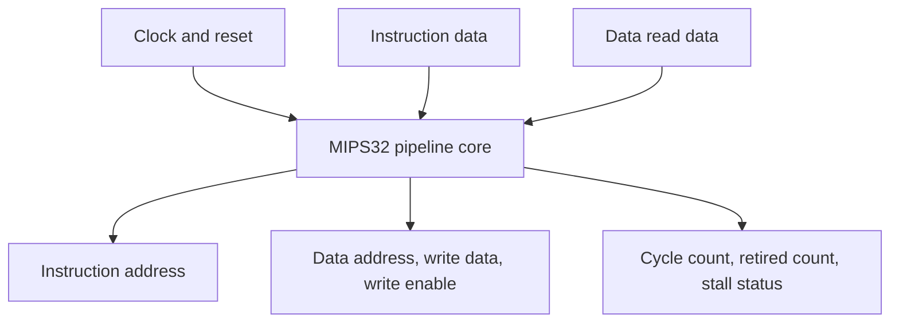
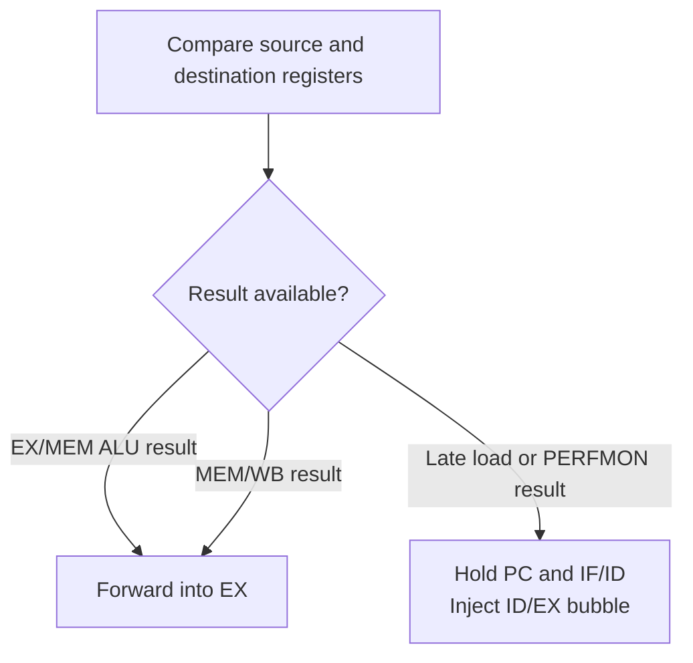

# Five-Stage MIPS32 Pipeline with Custom Instructions

A synthesizable SystemVerilog processor implementing a compact MIPS32 instruction subset, a classic five-stage pipeline, data forwarding, load-use interlocking, control-hazard flushing, a two-cycle `MULADD` instruction, and hardware performance counters accessible through `PERFMON`.

The repository presents the final processor as one coherent design. Testbench memories remain outside the core, keeping the RTL reusable with different instruction and data-memory implementations.

## Design highlights

- Five pipeline stages: IF, ID, EX, MEM, and WB
- EX/MEM and MEM/WB operand forwarding
- One-cycle interlock for load-use and performance-counter dependencies
- Taken-branch and jump flushing
- Two-cycle custom multiply-add execution
- Cycle and retired-instruction counters
- External instruction and data-memory interfaces
- Automated architectural simulation with Icarus Verilog and GitHub Actions
- Sanitized Design Compiler setup for the processor core

## Pipeline architecture


Each stage carries a `valid` bit alongside its data and control signals. A bubble is represented by `valid = 0`, allowing stalls and flushes to suppress side effects without treating arbitrary instruction words as retired operations.

## External interfaces



The instruction and data read ports are modeled as combinational interfaces in the testbench. Data writes occur when `dmem_write_enable` is asserted on the rising clock edge.

## Hazard handling



### Data forwarding

The forwarding unit compares the EX-stage source registers with destination registers in the MEM and WB stages. The newest available result has priority:

1. Forward an EX/MEM ALU result.
2. Otherwise, forward the MEM/WB writeback result.
3. Otherwise, use the value read from the register file.

Forwarding applies to ALU operands, branch comparisons, `MULADD` operands, and store data.

### Late-result interlock

A load or `PERFMON` result is not available through the EX/MEM ALU path. If the following instruction consumes that destination register, the hazard unit:

- Holds the program counter.
- Holds the IF/ID register.
- Inserts a bubble into ID/EX.

The dependent instruction proceeds on the next cycle and receives the value through MEM/WB forwarding.

### Control hazards

`BEQ` is resolved in EX with forwarded operands. A taken branch redirects the program counter and flushes the younger IF/ID and ID/EX contents. `J` is resolved in ID and flushes the sequentially fetched instruction.

## Custom instructions

### Two-cycle `MULADD`

`MULADD` uses an R-type encoding with function code `0x08`:

```text
MULADD rd, rs, rt
rd = (rs * rt) + rt
```

The first EX cycle multiplies the forwarded operands and stores the product. The pipeline front is held for that cycle and EX/MEM receives a bubble. The second EX cycle adds `rt`, releases the front of the pipeline, and sends the completed result to MEM.

### `PERFMON`

`PERFMON` uses an R-type encoding with function code `0x0F`. It writes a hardware counter into `rd`:

| `shamt[0]` | Value written |
| ---: | --- |
| `0` | Cycle counter |
| `1` | Retired-instruction counter |

The cycle counter increments every active cycle. The retired counter increments when a valid supported instruction reaches WB. Bubbles, zero-word NOPs, and unsupported encodings are not counted.

## Supported instruction subset

| Instruction | Operation |
| --- | --- |
| `ADD` | Signed/unsigned bitwise-equivalent 32-bit addition |
| `SUB` | 32-bit subtraction |
| `AND`, `OR` | Bitwise logic |
| `SLT` | Signed less-than comparison |
| `ADDI` | Sign-extended immediate addition |
| `LW`, `SW` | Word-aligned memory access |
| `BEQ` | Equality branch resolved in EX |
| `J` | Absolute jump resolved in ID |
| `MULADD` | Two-cycle `(rs * rt) + rt` custom operation |
| `PERFMON` | Read cycle or retirement counter |

## Repository files

| File | Contribution to the design |
| --- | --- |
| [`rtl/mips32_pipeline_core.sv`](rtl/mips32_pipeline_core.sv) | Pipeline registers, stage control, branch/jump recovery, MULADD sequencing, memory interfaces, and top-level integration |
| [`rtl/control_unit.sv`](rtl/control_unit.sv) | Instruction decode and generation of datapath control signals |
| [`rtl/hazard_forward_unit.sv`](rtl/hazard_forward_unit.sv) | Decode-stage interlocks and EX-stage operand forwarding selection |
| [`rtl/register_file.sv`](rtl/register_file.sv) | Two-read, one-write register file with hardwired register zero |
| [`rtl/alu.sv`](rtl/alu.sv) | Arithmetic, logic, and comparison operations |
| [`rtl/performance_counters.sv`](rtl/performance_counters.sv) | Cycle and valid-retirement counters used by `PERFMON` |
| [`programs/demo.hex`](programs/demo.hex) | Machine-code program covering forwarding, load-use, branch, jump, MULADD, and PERFMON behavior |
| [`tb/mips32_pipeline_tb.sv`](tb/mips32_pipeline_tb.sv) | End-to-end architectural checks and portable VCD generation |
| [`synthesis/compile_dc.tcl`](synthesis/compile_dc.tcl) | Sanitized core-only synthesis and timing-constraint flow |
| [`.github/workflows/rtl-simulation.yml`](.github/workflows/rtl-simulation.yml) | Automatic compilation and simulation on every push and pull request |

## Demonstration program

The supplied program intentionally creates dependencies and control-flow changes. It verifies:

- ALU-to-ALU and ALU-to-store forwarding
- A `LW` followed immediately by a dependent `ADD`
- A two-cycle `MULADD` followed by a dependent instruction
- A taken branch that flushes two wrong-path `ADDI` instructions
- Cycle and retirement-counter reads
- A self-looping jump

Expected architectural memory results include:

| Byte address | Expected value | Meaning |
| ---: | ---: | --- |
| `0` | 30 | Forwarded `ADD` result |
| `4` | 220 | `MULADD` result |
| `8` | 230 | Instruction dependent on `MULADD` |
| `12` | 40 | Instruction dependent on `LW` |
| `16` | 0 | Wrong-path writes were flushed |
| `20` | Nonzero | Cycle-counter snapshot |
| `24` | Nonzero | Retired-instruction snapshot |

The test also requires the cycle snapshot to exceed the retired-instruction snapshot and observes at least one late-result stall plus the `MULADD` hold cycle.

## Simulation

Using Icarus Verilog:

```bash
iverilog -g2012 -s mips32_pipeline_tb \
  -o processor.vvp rtl/*.sv tb/mips32_pipeline_tb.sv
vvp processor.vvp
```

A successful run prints:

```text
PASS: pipeline, hazards, MULADD, PERFMON, branch, and jump behavior verified
```

The testbench also creates `mips32_pipeline.vcd` for GTKWave. The same test runs automatically through GitHub Actions.

## Synthesis

The included Design Compiler script targets the processor core with a 2.0 ns clock constraint. External memories are represented by the core's instruction/data interfaces and are not synthesized by this script.

```bash
export PDK_DIR=/path/to/library-directory
cd synthesis
dc_shell -f compile_dc.tcl
```

### Historical Lab 2 synthesis snapshot

The original archive contained these academic Design Compiler reports. They describe the archived implementations, not the refactored RTL in this repository:

| Metric | Archived single-cycle | Archived pipeline |
| --- | ---: | ---: |
| Effective clock constraint | 3.00 ns | 2.00 ns |
| Reported setup slack | 0.00 ns | 0.00 ns |
| Standard cells | 4,667 | 10,611 |
| Total cell area | 13,038.092 library units | 48,614.014 library units |
| Dynamic-power estimate | 2.9340 mW | 11.1492 mW |
| Leakage-power estimate | 58.3755 µW | 147.0314 µW |

These numbers are not a controlled apples-to-apples comparison: the archived pipeline used an SRAM macro while the single-cycle version used register-based memories. Also, the original single-cycle Tcl expression performed integer division, producing a 3.00 ns constraint despite labeling the target as 300 MHz. Therefore, the reports demonstrate that each archived mapping met its own constraint, not a portable maximum frequency or direct architecture-only PPA comparison.

## Design limitations

- This is an educational MIPS32 subset, not a complete ISA implementation.
- Memory accesses assume word alignment and combinational read data.
- Exceptions, interrupts, privilege levels, caches, and virtual memory are outside scope.
- Integer multiplication is inferred from `*`; implementation latency and area depend on the synthesis target.
- The provided synthesis script requires a compatible standard-cell library and has not generated fresh results for the refactored RTL.
